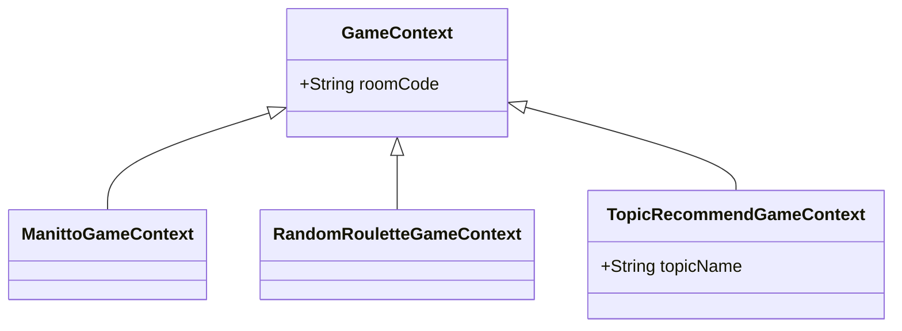

# 동적 DTO 바인딩 (Polymorphic Deserialization)

## 개요

우리 프로젝트의 WebSocket API 중 일부는 클라이언트가 보내는 JSON 데이터의 특정 필드(`type`) 값에 따라 서버에서 각기 다른 데이터 전송 객체(DTO)로 동적으로 변환(바인딩)하는 고급 기술을 사용합니다. 이를 **다형적 역직렬화(Polymorphic Deserialization)** 라고 합니다.

대표적인 예시는 `GameController`의 `start-game` 핸들러에서 사용되는 `GameContext`입니다.

```java
// GameController.java
@MessageMapping("/room/{roomCode}/start-game")
public void handleGameStarted(
        @DestinationVariable String roomCode,
        @Payload GameContext gameContext, // <--- 이 부분
        @CurrentUser Long userId
) { ... }
```

클라이언트는 동일한 API 목적지(`/app/room/{roomCode}/start-game`)로 메시지를 보내지만, JSON 페이로드에 어떤 `type`을 포함시키느냐에 따라 서버는 `gameContext`를 완전히 다른 하위 클래스 객체로 인식하고 처리합니다.

## 구현 원리: Jackson Annotation

이 기능은 Java의 JSON 처리 라이브러리인 **Jackson**이 제공하는 특별한 어노테이션을 통해 구현됩니다.

`GameContext` 클래스 정의를 살펴보면 다음과 같습니다.

```java
// GameContext.java
@JsonTypeInfo(
        use = JsonTypeInfo.Id.NAME,
        include = JsonTypeInfo.As.PROPERTY,
        property = "type" // 1. JSON의 'type' 프로퍼티를 타입 구분자로 사용
)
@JsonSubTypes({
        // 2. 'type' 값에 따라 실제 매핑될 클래스를 정의
        @JsonSubTypes.Type(value = ManittoGameContext.class, name = "MANITTO"),
        @JsonSubTypes.Type(value = RandomRouletteGameContext.class, name = "RANDOM_ROULETTE"),
        @JsonSubTypes.Type(value = TopicRecommendGameContext.class, name = "TOPIC_RECOMMEND")
})
public sealed abstract class GameContext permits ... {
    private final String roomCode;
}
```

1.  `@JsonTypeInfo`: Jackson에게 이 클래스가 다형성 타입 처리가 필요함을 알립니다.
    -   `use = JsonTypeInfo.Id.NAME`: 타입 구분자로 논리적인 이름을 사용합니다.
    -   `include = JsonTypeInfo.As.PROPERTY`: 타입 정보를 별도의 프로퍼티(필드)로 JSON에 포함시킵니다.
    -   `property = "type"`: 그 프로퍼티의 이름을 `type`으로 지정합니다. 즉, JSON 페이로드의 `type` 필드 값을 보고 어떤 클래스로 만들지 결정하게 됩니다.

2.  `@JsonSubTypes`: `type` 필드의 각 값(`name`)이 어떤 클래스(`value`)에 해당하는지를 명시적으로 매핑합니다.

## 클래스 구조

`GameContext`와 그 자식 클래스들의 구조는 다음과 같습니다.



- `ManittoGameContext`와 `RandomRouletteGameContext`는 부모인 `GameContext`의 필드 외에 추가적인 필드가 없습니다.
- `TopicRecommendGameContext`는 `topicName`이라는 추가적인 필드를 가지고 있습니다.

## 실제 API 요청 예시

이러한 구조 덕분에 클라이언트는 다음과 같이 `type`에 따라 각기 다른 구조의 JSON을 보낼 수 있으며, 서버는 이를 올바르게 처리할 수 있습니다.

- **MANITTO 게임 시작 요청**

  ```json
  {
    "roomCode": "a1b2c3d4",
    "type": "MANITTO"
  }
  ```
  > 서버에서는 `ManittoGameContext` 객체로 바인딩됩니다.

- **TOPIC_RECOMMEND 게임 시작 요청**

  ```json
  {
    "roomCode": "a1b2c3d4",
    "type": "TOPIC_RECOMMEND",
    "topicName": "영화" 
  }
  ```
  > 서버에서는 `topicName` 필드까지 포함된 `TopicRecommendGameContext` 객체로 바인딩됩니다.

이처럼 다형성 바인딩을 활용하면 여러 종류의 요청을 단일 API 엔드포인트에서 효율적으로 처리할 수 있으며, 향후 새로운 게임 종류가 추가되더라도 컨트롤러의 변경 없이 `GameContext`의 하위 클래스와 `@JsonSubTypes` 설정만 추가하여 유연하게 확장할 수 있습니다.
