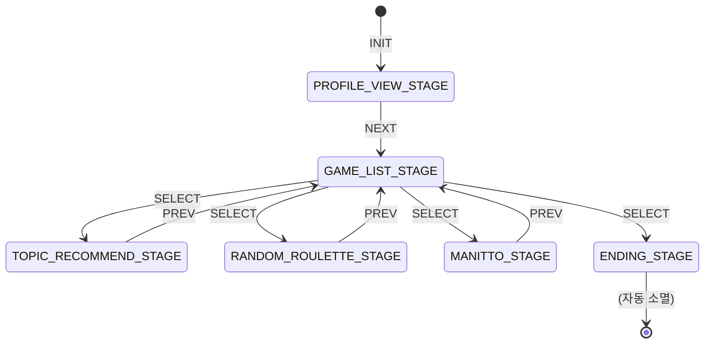

# Room State Machine

## 개요

'얼음땡' 프로젝트의 방(Room)은 단순한 참여자 컨테이너가 아니라, 명확한 생명주기를 갖는 상태 머신(State Machine)으로 관리됩니다. 이를 통해 각 시점의 방의 상태(`Stage`)를 명확히 하고, 상태에 따른 행위를 제어하며, 예측 가능한 흐름을 보장합니다.

상태 전이는 `RoomStageStateMachine`에 의해 관리되며, Redis에 현재 방의 상태가 저장됩니다.

## 상태 다이어그램

방의 상태(Stage)와 전이(Transition)는 아래 다이어그램과 같습니다.

## 상태 (Stages)

`Stage.java`에 정의된 각 상태는 방의 특정 시점을 나타냅니다.

- **`PROFILE_VIEW_STAGE`**: 게임 시작 전, 참여자들이 서로의 프로필을 확인하는 초기 단계입니다.
- **`GAME_LIST_STAGE`**: 방장이 플레이할 게임을 선택하는 단계입니다. 이 단계에서 다른 게임 스테이지 또는 종료 스테이지로 분기됩니다.
- **`MANITTO_STAGE`**: '마니또' 게임이 진행 중인 상태입니다.
- **`RANDOM_ROULETTE_STAGE`**: '랜덤 룰렛' 게임이 진행 중인 상태입니다.
- **`TOPIC_RECOMMEND_STAGE`**: '토픽 추천' 게임이 진행 중인 상태입니다.
- **`ENDING_STAGE`**: 모든 게임이 끝나고 방이 소멸되기 직전의 최종 단계입니다. 이 상태가 되면 방과 관련된 데이터(Stage 정보)가 Redis에서 삭제됩니다.

## 이벤트 (Events)

상태 전이는 `StageEventType`으로 정의된 이벤트를 통해 트리거됩니다. 이 이벤트는 방장에 의해서만 발생시킬 수 있습니다.

- **`INIT`**: 방이 처음 생성되고 상태 머신이 초기화될 때 발생하는 내부 이벤트입니다.
- **`NEXT`**: 논리적인 다음 단계로 이동합니다. (예: 프로필 보기 → 게임 목록)
- **`PREV`**: 이전 단계로 돌아갑니다. (예: 게임 진행 → 게임 목록)
- **`SELECT`**: 특정 상태(주로 게임)를 선택하여 직접 해당 상태로 이동합니다.

이러한 상태 관리는 `/app/room/{roomCode}/change-stage` WebSocket API를 통해 이루어지며, 자세한 내용은 [Room WebSocket API 문서](../api/websocket/room.md)에서 확인할 수 있습니다.
