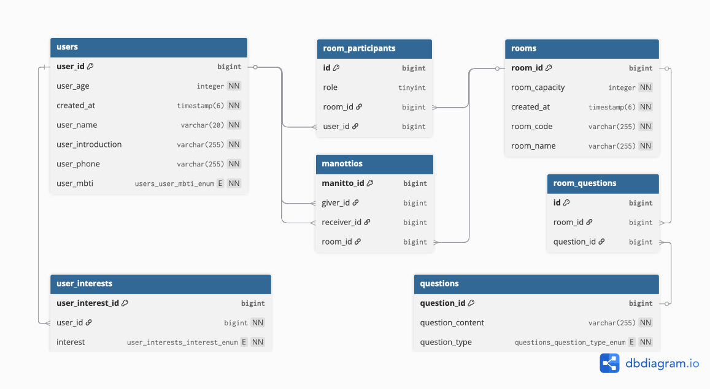

# 데이터베이스 구조 (ERD)

본 문서는 '얼음땡' 프로젝트의 데이터베이스 테이블 구조와 관계를 설명합니다.

## 테이블 설명

### `users`

사용자 정보를 저장하는 테이블입니다.

- **주요 컬럼**:
    - `user_id` (PK): 사용자 고유 ID
    - `user_name`: 사용자 이름
    - `user_phone`: 전화번호 (고유값)
    - `user_age`: 나이
    - `user_mbti`: MBTI 유형
    - `user_introduction`: 한 줄 소개

### `rooms`

생성된 게임방의 정보를 저장하는 테이블입니다.

- **주요 컬럼**:
    - `room_id` (PK): 방 고유 ID
    - `room_code`: 방 참여를 위한 고유 코드
    - `room_name`: 방 이름
    - `room_capacity`: 최대 인원

### `room_participants`

사용자와 방의 다대다 관계를 나타내는 중간 테이블입니다. 어떤 사용자가 어떤 방에 어떤 역할(HOST, MEMBER)로 참여하는지 저장합니다.

- **주요 컬럼**:
    - `id` (PK): 관계 고유 ID
    - `room_id` (FK): `rooms` 테이블 참조
    - `user_id` (FK): `users` 테이블 참조
    - `role`: 방에서의 역할 (HOST 또는 MEMBER)

### `questions`

아이스브레이킹에 사용될 질문 내용을 저장하는 테이블입니다.

- **주요 컬럼**:
    - `question_id` (PK): 질문 고유 ID
    - `question_content`: 질문 내용
    - `question_type`: 질문 유형 (COMMON, PERSONAL 등)

### `room_questions`

각 방에서 사용되는 질문 목록을 관리합니다. `rooms`와 `questions`의 다대다 관계를 나타냅니다.

- **주요 컬럼**:
    - `id` (PK): 관계 고유 ID
    - `room_id` (FK): `rooms` 테이블 참조
    - `question_id` (FK): `questions` 테이블 참조

### `user_interests`

사용자의 관심사를 저장합니다. `users`와 `interests`의 다대다 관계를 나타냅니다.

- **주요 컬럼**:
    - `user_interest_id` (PK): 관계 고유 ID
    - `user_id` (FK): `users` 테이블 참조
    - `interest`: 관심사 (Enum 타입)

### `manittos`

마니또 게임 진행 시, 누가 누구의 마니또인지 관계를 저장하는 테이블입니다.

- **주요 컬럼**:
    - `manitto_id` (PK): 관계 고유 ID
    - `giver_id` (FK): 마니또 역할을 하는 사용자 (`users` 테이블 참조)
    - `receiver_id` (FK): 마니또의 도움을 받는 사용자 (`users` 테이블 참조)
    - `room_id` (FK): 게임이 진행된 방 (`rooms` 테이블 참조)
